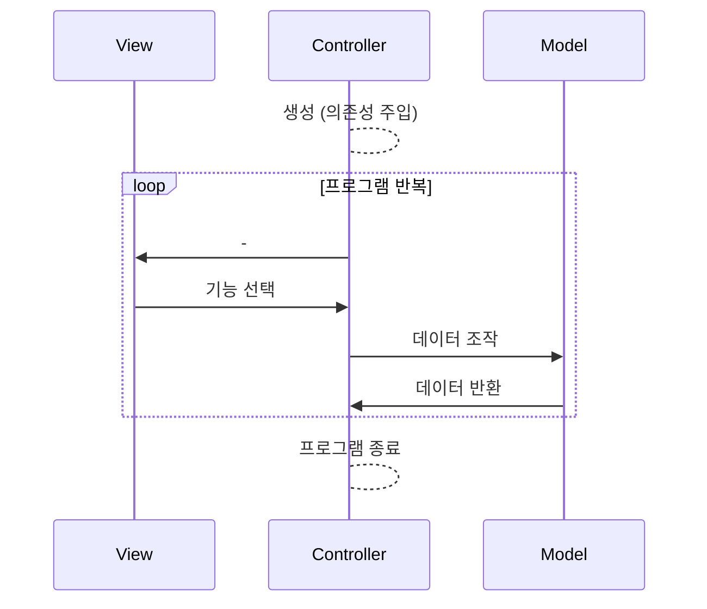

# All-rounder Backend Study

## 기능 구현 목록

- [ ] 회원 정보 CRUD
    - [ ] C - 회원 등록
    - [ ] R - 쿠폰 조회
    - [ ] U - 쿠폰 적립 / 사용
    - [ ] D - X

### Flow Chart

```mermaid
sequenceDiagram
    participant View
    participant Controller
    participant Model
    Controller --> Controller: 생성 (의존성 주입)
    loop 프로그램 반복
        Controller ->> View: -
        View ->> Controller: 기능 선택
        Controller ->> Model: 데이터 조작
        Model ->> Controller: 데이터 반환
    end
    Controller --> Controller: 프로그램 종료
```